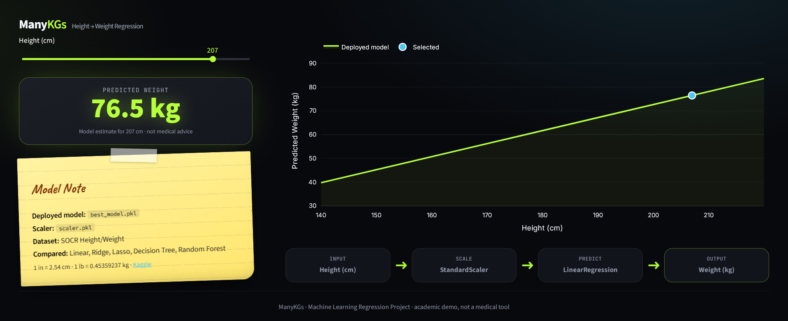

# ManyKGs

**Height → Weight Regression** — a Streamlit dashboard that serves a scikit-learn regression model exported from a Jupyter notebook.




## Suggested GitHub description

> Streamlit app that predicts weight (kg) from height (cm) with a scikit-learn regression model trained on the SOCR Height/Weight dataset.

Topics: `machine-learning` `regression` `streamlit` `scikit-learn` `plotly` `python`

## Features

- Height slider with live weight prediction
- `StandardScaler` → `LinearRegression` pipeline loaded from pickles (model type detected at runtime)
- Interactive Plotly regression curve over a sample of the real SOCR data
- Model note and pipeline overview
- Dark, responsive UI

## How it works

`height_cm → scaler.transform → model.predict → weight_kg`

## Project structure

```
ManyKGs/
├── app.py                      # Streamlit app
├── requirements.txt
├── models/
│   ├── best_model.pkl          # deployed model (LinearRegression)
│   └── scaler.pkl              # StandardScaler fitted on training heights
├── models_notebook/
│   ├── HT_WEIGHT.ipynb         # training / evaluation notebook
│   └── SOCR-HeightWeight.csv   # original dataset (inches / pounds)
└── repo_screenshots/page.png
```

## The notebook

`models_notebook/HT_WEIGHT.ipynb` loads the dataset (25,000 rows), converts units
(`cm = in × 2.54`, `kg = lb × 0.45359237`), splits 80/20, fits a `StandardScaler`, and compares five models on the test set:

| Model | MAE (kg) | R² |
|---|---|---|
| **Linear Regression** (deployed) | 3.645 | 0.2606 |
| Ridge Regression | 3.645 | 0.2606 |
| Lasso Regression | 3.645 | 0.2599 |
| Decision Tree | 5.116 | -0.4287 |
| Random Forest | 4.362 | -0.0575 |

The highest-R² model was exported as `best_model.pkl`. Height alone explains only about a quarter of the variance in weight, so predictions are broad estimates.
The notebook also tries polynomial features, XGBoost and SVR as later experiments; **none of those are deployed**.

## Install & run

```
pip install -r requirements.txt
streamlit run app.py
```

The pickles were saved with scikit-learn 1.6.1. For exact fidelity use `pip install scikit-learn==1.6.1` (newer versions load them but may warn).
`models_notebook/SOCR-HeightWeight.csv` is optional — if absent, the app just omits the data scatter.

## Dataset

[SOCR Height and Weight (Kaggle)](https://www.kaggle.com/datasets/burnoutminer/heights-and-weights-dataset)

## Disclaimer

An academic regression demonstration, **not a medical tool**. Outputs are model estimates only.
